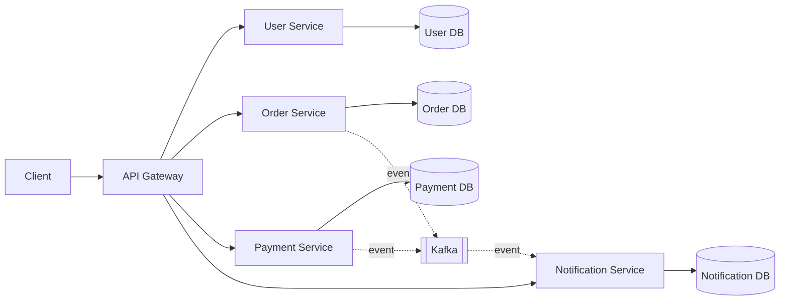
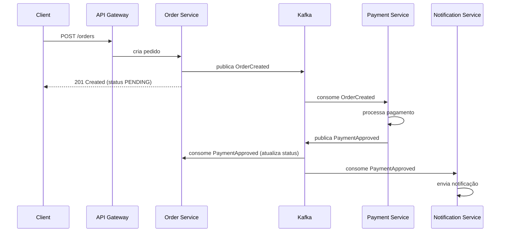

# Case de Estudos: Microservices Architecture

2026-09-19 · @Someone

## Visão Geral do Projeto

Este documento estabelece a documentação técnica e o planejamento completo de um **case de estudos prático de Microservices Architecture**, com o objetivo de servir como peça de portfólio que demonstre domínio real de arquitetura distribuída — não apenas o uso de ferramentas, mas a capacidade de tomar decisões arquiteturais, documentá-las e sustentá-las.

**O que será construído:** um sistema de e-commerce simplificado composto por 4 microsserviços independentes (User, Order, Payment, Notification), cada um com seu próprio banco de dados, comunicando-se via API Gateway (chamadas síncronas) e mensageria assíncrona (eventos).

**Por que este case:** o domínio (e-commerce) é simples o suficiente para não distrair da arquitetura, mas rico o suficiente para justificar desacoplamento real entre serviços — um pedido dispara pagamento, que dispara notificação, cenário clássico para demonstrar comunicação assíncrona, consistência eventual e tolerância a falhas.

**O que este case demonstra para quem avaliar o portfólio:**

- Design de fronteiras de serviço (bounded contexts) e por que cada serviço tem seu próprio banco
- Trade-offs entre comunicação síncrona e assíncrona
- Padrões de resiliência (circuit breaker, retry, timeout)
- Observabilidade em sistemas distribuídos (logging correlacionado, tracing, métricas)
- Documentação de decisões arquiteturais via ADRs
- Testes em múltiplos níveis num sistema distribuído

Antes de qualquer linha de código, todo o planejamento abaixo (arquitetura, contratos entre serviços, stack, ADRs, testes, roadmap) será fechado e revisado.

## Arquitetura Proposta



O **API Gateway** é o único ponto de entrada externo — roteia requisições síncronas para o serviço correto, centraliza autenticação (JWT), rate limiting e agregação de respostas quando necessário.

**Fluxo síncrono (via Gateway):** operações de leitura e escrita diretas — cadastro de usuário, consulta de pedido, consulta de status de pagamento — respondem em request/response tradicional (REST).

**Fluxo assíncrono (via Kafka):** o `Order Service`, ao criar um pedido, publica um evento `OrderCreated`. O `Payment Service` consome esse evento, processa o pagamento e publica `PaymentApproved` ou `PaymentFailed`. O `Notification Service` consome esses eventos para disparar e-mails/notificações, sem acoplamento direto a nenhum dos outros dois serviços.

Cada serviço é dono exclusivo do seu banco de dados (**Database per Service**) — nenhum serviço acessa a tabela de outro diretamente, apenas via API ou evento. Isso é o que garante independência real de deploy e de evolução do schema.

## Detalhamento dos Serviços

| Serviço | Responsabilidade | Endpoints principais | Banco de dados | Publica / Consome eventos |
| --- | --- | --- | --- | --- |
| User Service | Cadastro, autenticação e perfil de usuários | `POST /users`, `GET /users/{id}`, `POST /auth/login` | PostgreSQL (`user_db`) | — |
| Order Service | Criação e consulta de pedidos, orquestra o ciclo de vida do pedido | `POST /orders`, `GET /orders/{id}`, `GET /orders/user/{userId}` | PostgreSQL (`order_db`) | Publica `OrderCreated`; consome `PaymentApproved`, `PaymentFailed` |
| Payment Service | Processamento de pagamento (simulado/gateway mock) | `POST /payments`, `GET /payments/{orderId}` | PostgreSQL (`payment_db`) | Consome `OrderCreated`; publica `PaymentApproved`, `PaymentFailed` |
| Notification Service | Envio de notificações (e-mail simulado) por evento | `GET /notifications/user/{userId}` | MongoDB (`notification_db`) | Consome `OrderCreated`, `PaymentApproved`, `PaymentFailed` |

O **Order Service** é o orquestrador natural do fluxo (padrão próximo de **Choreography-based Saga**, sem um orquestrador central dedicado nesta primeira versão — decisão registrada em ADR-003).

O **Notification Service** usa MongoDB propositalmente diferente dos demais (PostgreSQL), para o case demonstrar na prática o benefício de **Technology Diversity**: o modelo de dados de notificação é orientado a documento (histórico de mensagens por usuário), enquanto os demais são relacionais.

## Stack Tecnológica

Escolhida para se apoiar na sua stack de produção atual, evitando ferramentas novas por si só e mantendo o foco do case na arquitetura:

| Camada | Tecnologia | Justificativa |
| --- | --- | --- |
| Linguagem / Framework | Java 21 + Spring Boot 3 | Stack principal já dominada |
| Segurança | Spring Security + JWT | Autenticação stateless entre Gateway e serviços |
| API Gateway | Spring Cloud Gateway | Integração nativa com o ecossistema Spring |
| Comunicação síncrona | REST (OpenFeign entre serviços quando necessário) | Simplicidade e observabilidade de contrato |
| Comunicação assíncrona | Apache Kafka | Já usado em produção; permite discutir particionamento, consumer groups, at-least-once delivery |
| Persistência relacional | PostgreSQL | Um schema por serviço (User, Order, Payment) |
| Persistência documento | MongoDB | Notification Service — demonstra poliglota |
| Cache | Redis | Cache de leitura no User Service (perfil) e idempotência de eventos no Payment Service |
| Containerização | Docker + Docker Compose | Ambiente local reproduzível para os 4 serviços + Kafka + bancos |
| Orquestração (opcional, fase avançada) | Kubernetes (Minikube/Kind local) | Demonstrar deploy independente e scaling horizontal |
| Observabilidade | Spring Boot Actuator, Micrometer, Zipkin/OpenTelemetry, ELK ou Loki | Tracing distribuído e logs correlacionados por `traceId` |
| Documentação de API | OpenAPI/Swagger por serviço | Contrato explícito consumível por outros times |
| Infraestrutura (fase final) | AWS (ECS ou EKS, RDS, MSK ou Kafka self-managed) | Aproveitar certificações AWS já obtidas para levar o case à nuvem |

A decisão de manter Kubernetes e AWS como fases opcionais/avançadas evita que a complexidade de infraestrutura atrase a entrega do núcleo arquitetural (os 4 serviços funcionando com Docker Compose primeiro).

## Comunicação entre Serviços



**Síncrona (REST via Gateway):** usada onde o cliente precisa de resposta imediata — cadastro, login, consultas. Aplica timeout curto e circuit breaker (Resilience4j) para não deixar uma falha em um serviço travar o Gateway inteiro.

**Assíncrona (Kafka):** usada onde o processamento pode ser eventual — a criação do pedido retorna imediatamente com status `PENDING`, e o cliente consulta depois o status atualizado. Isso é o que dá resiliência: se o Payment Service cair, os eventos ficam no tópico Kafka esperando, sem perder o pedido.

**Consistência eventual e idempotência:** como o pagamento pode ser processado mais de uma vez (reentrega de mensagem), o Payment Service usa uma chave de idempotência (armazenada em Redis) para garantir que o mesmo pedido não seja cobrado duas vezes.

## Decisões Arquiteturais (ADRs)

Cada uma destas vai virar um documento ADR próprio (contexto, decisão, consequências, alternativas rejeitadas) antes da implementação do trecho correspondente:

| # | Decisão | Alternativa rejeitada (resumo) |
| --- | --- | --- |
| ADR-001 | Database per Service (cada serviço com seu próprio banco) | Banco compartilhado único — rejeitado por acoplar deploys e schemas |
| ADR-002 | Kafka para comunicação assíncrona entre Order/Payment/Notification | RabbitMQ — rejeitado nesta fase por já haver experiência prévia com Kafka |
| ADR-003 | Choreography (coreografia de eventos) em vez de orquestrador central (Saga Orchestrator) | Orchestration-based Saga — adiado para uma fase 2 do case, se a complexidade justificar |
| ADR-004 | API Gateway como único ponto de entrada externo | Comunicação direta client → cada serviço — rejeitado por espalhar autenticação e CORS |
| ADR-005 | Idempotência via chave armazenada em Redis no Payment Service | Idempotência via constraint no banco — mantida como camada extra, não substitui o Redis |
| ADR-006 | PostgreSQL para User/Order/Payment, MongoDB para Notification | Um único banco para todos — rejeitado por não demonstrar poliglota persistence |

Esta tabela é o índice; cada ADR será detalhado como registro individual (formato Michael Nygard: Título, Status, Contexto, Decisão, Consequências) conforme a implementação avançar.

## Observabilidade

Um dos maiores desafios reais de microsserviços é entender o que acontece atravessando 4 processos diferentes — o case trata isso como requisito de primeira classe, não como extra:

- **Logging correlacionado:** todo log inclui um `traceId`/`correlationId` gerado no Gateway e propagado via header HTTP e via header de mensagem Kafka, permitindo reconstruir o caminho completo de uma requisição pelos 4 serviços.
- **Tracing distribuído:** instrumentação com OpenTelemetry, exportando para Zipkin (local) — visualiza o tempo gasto em cada salto (Gateway → Order → Kafka → Payment → Kafka → Notification).
- **Métricas:** Spring Boot Actuator + Micrometer expondo métricas de latência, taxa de erro e throughput por serviço, coletadas via Prometheus e visualizadas em Grafana.
- **Health checks:** endpoint `/actuator/health` por serviço, incluindo verificação de conectividade com banco e com Kafka.
- **Centralização de logs:** agregação via Loki ou stack ELK, com dashboards por serviço e por `traceId`.

Esta seção também vai documentar, na prática, como diagnosticar uma falha distribuída (ex.: pedido fica `PENDING` para sempre) usando esses três pilares — logs, métricas e traces — como exercício central do case.

## Estratégia de Testes

| Nível | Escopo | Ferramentas |
| --- | --- | --- |
| Unitário | Regras de negócio isoladas por serviço (ex.: cálculo de status do pedido) | JUnit 5, Mockito |
| Integração | Serviço + seu próprio banco, subindo dependências reais | Testcontainers (PostgreSQL/MongoDB), `@SpringBootTest` |
| Contrato | Garantir que Order Service e Payment Service concordam no formato dos eventos Kafka | Spring Cloud Contract ou Pact |
| Componente (Kafka) | Publicar e consumir eventos reais em um broker de teste | Testcontainers Kafka |
| Ponta a ponta (E2E) | Fluxo completo: criar pedido → pagamento aprovado → notificação enviada | Docker Compose + testes via REST Assured |
| Resiliência | Simular indisponibilidade de um serviço e validar circuit breaker / retry | Chaos-lite manual (derrubar container) nesta fase |

A meta de cobertura não é um número arbitrário de %, e sim garantir que os **contratos entre serviços** (REST e eventos) tenham teste de contrato — é o ponto onde sistemas distribuídos mais quebram silenciosamente em produção, e o que mais vale demonstrar num case de portfólio.

## Estrutura de Repositórios

Adotando **monorepo** para facilitar navegação e revisão num case de portfólio (recrutador/avaliador vê tudo em um lugar só), com módulos Maven independentes:

```
microservices-case-study/
├── docs/
│   ├── adr/                  # ADR-001.md, ADR-002.md, ...
│   └── diagrams/
├── api-gateway/
├── user-service/
│   ├── src/main/java/...
│   └── Dockerfile
├── order-service/
├── payment-service/
├── notification-service/
├── docker-compose.yml         # sobe todos os serviços + Kafka + Postgres + Mongo + Redis + Zipkin
├── k8s/                       # manifests (fase avançada)
└── README.md
```

Cada serviço é um módulo Spring Boot independente, com seu próprio `pom.xml`, testes e `Dockerfile` — reforçando na estrutura do repositório o mesmo princípio de independência que a arquitetura defende. O `docker-compose.yml` na raiz é o que permite rodar o case inteiro localmente com um único comando.

## Roadmap de Implementação

| Fase | Entregável | Escopo |
| --- | --- | --- |
| 0 — Planejamento (esta doc) | Documentação técnica completa | Arquitetura, ADRs, stack, testes — sem código |
| 1 — Fundação | User Service standalone | CRUD de usuário, auth JWT, testes unitários e de integração, Dockerfile |
| 2 — Núcleo síncrono | Order Service + API Gateway | Criação/consulta de pedido, roteamento via Gateway, Order → User (validação síncrona) |
| 3 — Assincronismo | Payment Service + Kafka | Tópicos `OrderCreated`/`PaymentApproved`/`PaymentFailed`, idempotência via Redis |
| 4 — Fechamento do fluxo | Notification Service | Consumo dos eventos, persistência em MongoDB, notificação simulada |
| 5 — Observabilidade | Tracing + logs + métricas | OpenTelemetry, Zipkin, Actuator, dashboards |
| 6 — Resiliência | Circuit breaker, retry, timeout | Resilience4j no Gateway e nas chamadas entre serviços |
| 7 — Documentação final | README + ADRs completos + diagramas | Case pronto para portfólio |
| 8 — Avançado (opcional) | Deploy em AWS (ECS/EKS) | Aplicar certificações AWS na prática |

Cada fase só começa com a fase anterior funcionando e testada — o objetivo é ter, a qualquer momento, um sistema rodando e demonstrável via `docker-compose up`, mesmo que incompleto.
