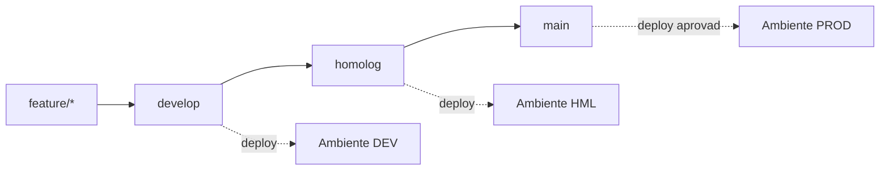

# Execução com Claude Code

Guia operacional: do repositório vazio ao projeto completo, com você orquestrando e o Claude Code implementando.

## Pré-requisitos

Instale e valide antes de abrir o Claude Code, para que ele não trave em dependência faltando no meio de uma tarefa:

| Ferramenta | Verificação | Observação |
| --- | --- | --- |
| Java 21 (JDK) | `java -version` | Temurin ou Corretto |
| Maven 3.9+ | `mvn -version` | Ou usar o wrapper `mvnw` gerado por serviço |
| Docker + Docker Compose | `docker compose version` | Essencial: Kafka, Postgres, Mongo, Redis sobem aqui |
| Git | `git --version` | Configure `user.name` e `user.email` |
| GitHub CLI | `gh --version` | Deixa o Claude Code criar repo, PR e secrets pelo terminal |
| Node.js 18+ | `node -v` | Requisito do Claude Code |
| Claude Code | `claude --version` | Instale conforme a documentação oficial |

Autentique o GitHub CLI uma vez com `gh auth login` — a partir daí o Claude Code consegue criar repositório, abrir PRs e configurar secrets sem você sair do terminal.

Para este projeto a recomendação é rodar o Claude Code **na raiz do monorepo**, não dentro de um serviço específico: ele precisa enxergar o `docker-compose.yml`, os contratos entre serviços e a pasta `docs/adr/` para manter coerência arquitetural.

## Criação do Repositório no GitHub

Faça este passo você mesmo, uma vez — é rápido e garante que o repositório nasce com a configuração que você quer:

```bash
mkdir microservices-case-study && cd microservices-case-study
git init

# README e .gitignore mínimos para o primeiro commit
echo "# Microservices Case Study" > README.md
curl -sL https://raw.githubusercontent.com/github/gitignore/main/Java.gitignore -o .gitignore

git add . && git commit -m "chore: initial commit"

# cria o repositório remoto já conectado
gh repo create microservices-case-study --public --source=. --remote=origin --push
```

Em seguida, crie as branches que representam os ambientes:

```bash
git branch develop && git push -u origin develop
git branch homolog && git push -u origin homolog
# main já existe e representa produção
```

Proteja as branches no GitHub (Settings → Branches → Add rule) para `main` e `homolog`: exigir Pull Request, exigir que o CI passe e bloquear push direto. Isso obriga todo código gerado pelo Claude Code a passar por PR — que é exatamente o ponto de controle onde você exerce a orquestração e a revisão.

Crie também os três **Environments** no GitHub (Settings → Environments): `development`, `homolog`, `production`. Cada um guarda seus próprios secrets e o de produção pode exigir aprovação manual antes do deploy.

## CLAUDE.md — o arquivo de contexto

Este é o arquivo mais importante da sua orquestração. Ele fica na raiz do repositório e é lido automaticamente pelo Claude Code a cada sessão — é o que evita você repetir as mesmas instruções toda vez e o que mantém as decisões arquiteturais respeitadas ao longo de semanas de trabalho.

```markdown
# Microservices Case Study

## Contexto
Sistema de e-commerce em microsserviços, projeto de portfólio.
Arquitetura, ADRs e roadmap estão em `docs/`. Leia `docs/adr/` antes
de qualquer decisão estrutural.

## Stack
- Java 21, Spring Boot 3, Maven (multi-módulo)
- Spring Cloud Gateway, Spring Security + JWT
- Kafka, PostgreSQL, MongoDB, Redis
- Docker Compose para ambiente local
- Testes: JUnit 5, Mockito, Testcontainers

## Regras invioláveis
- Nenhum serviço acessa o banco de outro. Apenas API ou evento.
- Toda mudança de contrato (REST ou evento Kafka) exige atualizar
  o OpenAPI/schema do evento E um teste de contrato.
- Toda decisão arquitetural nova exige um ADR em `docs/adr/`.
- Código novo sem teste não é considerado pronto.
- Nunca commitar credencial. Configuração sensível vem de variável
  de ambiente.

## Convenções
- Commits: Conventional Commits (feat:, fix:, chore:, docs:, test:)
- Branch: feature/<servico>-<descricao-curta>
- Pacotes: br.com.<seunome>.<servico>
- Camadas por serviço: controller / service / repository / domain / config

## Comandos úteis
- Subir ambiente local: `docker compose up -d`
- Rodar testes de um serviço: `mvn -pl order-service test`
- Build completo: `mvn clean install`

## Como trabalhar comigo
- Antes de implementar algo grande, apresente o plano e espere aprovação.
- Trabalhe um serviço/fase por vez, conforme o roadmap em `docs/`.
- Ao terminar uma tarefa, rode os testes e mostre o resultado.
```

Cada serviço também pode ter seu próprio `CLAUDE.md` na sua pasta, com detalhes específicos (endpoints, eventos que publica/consome) — o Claude Code combina o da raiz com o do diretório em que está trabalhando.

## Branches e Ambientes



| Ambiente | Branch | Profile Spring | Infraestrutura | Deploy |
| --- | --- | --- | --- | --- |
| Desenvolvimento | `develop` | `dev` | Docker Compose local ou AWS ECS pequeno | Automático a cada merge |
| Homologação | `homolog` | `hml` | AWS (réplica reduzida de produção) | Automático a cada merge |
| Produção | `main` | `prod` | AWS (RDS, MSK, ECS/EKS) | Automático com aprovação manual |

**Fluxo de trabalho por tarefa:** o Claude Code cria uma branch `feature/order-service-criacao-pedido`, implementa, roda os testes e abre PR para `develop`. Você revisa o PR. Quando um conjunto de features está estável em `develop`, abre-se PR de `develop` → `homolog` para validação integrada. Aprovado em homologação, PR de `homolog` → `main`.

**Por que três branches e não só `main`:** em um case de portfólio isso demonstra entendimento de promoção de artefato entre ambientes — o mesmo código (mesma imagem Docker, idealmente) sobe em dev, é validado em homologação e só então vai para produção, mudando apenas a configuração, nunca o código.

## Configuração por Ambiente

Cada serviço tem a mesma estrutura de configuração, mudando apenas valores — nunca código:

```
src/main/resources/
├── application.yml           # comum a todos os ambientes
├── application-dev.yml       # desenvolvimento
├── application-hml.yml       # homologação
└── application-prod.yml      # produção
```

O perfil ativo vem sempre de fora, nunca fixo no código:

```yaml
# application.yml
spring:
  application:
    name: order-service
  profiles:
    active: ${SPRING_PROFILES_ACTIVE:dev}
  datasource:
    url: ${DB_URL}
    username: ${DB_USER}
    password: ${DB_PASSWORD}
  kafka:
    bootstrap-servers: ${KAFKA_BROKERS}
```

| Configuração | dev | hml | prod |
| --- | --- | --- | --- |
| Banco de dados | Container local | RDS pequeno | RDS com Multi-AZ |
| Kafka | Container local | MSK ou container | MSK |
| Nível de log | `DEBUG` | `INFO` | `INFO`/`WARN` |
| Swagger exposto | Sim | Sim | Não |
| Actuator endpoints | Todos | Health, metrics | Health apenas |
| Flyway `clean` permitido | Sim | Não | Não |

**Secrets:** localmente usa-se um `.env` (fora do Git, listado no `.gitignore`); em homologação e produção, GitHub Environment Secrets alimentam variáveis de ambiente, e na AWS a recomendação é AWS Secrets Manager ou Parameter Store. Nenhuma credencial entra no repositório em momento algum — essa é uma regra que já está no `CLAUDE.md` para o Claude Code nunca violar.

## CI/CD com GitHub Actions

Dois workflows bastam, em `.github/workflows/`:

**`ci.yml` — roda em todo PR e em todo push:** compila, roda testes unitários e de integração (Testcontainers), e falha o PR se algo quebrar. É o guarda-corpo que impede código gerado automaticamente de entrar quebrado.

```yaml
name: CI
on:
  pull_request:
  push:
    branches: [develop, homolog, main]
jobs:
  build:
    runs-on: ubuntu-latest
    steps:
      - uses: actions/checkout@v4
      - uses: actions/setup-java@v4
        with:
          java-version: '21'
          distribution: 'temurin'
          cache: maven
      - name: Build e testes
        run: mvn -B clean verify
```

**`cd.yml` — deploy por ambiente:** dispara conforme a branch, constrói a imagem Docker de cada serviço, publica no registry (GHCR ou ECR) e faz o deploy no ambiente correspondente.

| Gatilho | Environment do GitHub | Ação |
| --- | --- | --- |
| push em `develop` | `development` | Build + deploy automático |
| push em `homolog` | `homolog` | Build + deploy automático |
| push em `main` | `production` | Build + deploy **com aprovação manual** |

A aprovação manual em produção se configura no próprio GitHub Environment (required reviewers) — nenhum código no workflow. Nas fases iniciais do roadmap, o `cd.yml` pode apenas construir e publicar a imagem, sem deploy real; o deploy na AWS entra na Fase 8.

O Claude Code consegue escrever esses dois workflows inteiros — mas revise você mesmo as permissões e os secrets referenciados antes de aprovar o PR.

## Como Orquestrar o Claude Code

O ciclo que se repete para cada tarefa do roadmap:

1. **Contextualize** — aponte a fase do roadmap e os ADRs relevantes. Ex.: `Vamos para a Fase 3 do roadmap em docs/. Leia ADR-002 e ADR-005 antes de começar.`
2. **Peça o plano antes do código** — `Me apresente o plano de implementação: arquivos que vai criar, estrutura de pacotes, eventos e contratos. Não escreva código ainda.`
3. **Revise o plano** — este é o momento de maior aprendizado e o ponto onde a orquestração realmente acontece. Corrija fronteiras de serviço, nomes de eventos, decisões de persistência.
4. **Autorize a implementação em fatias** — um serviço ou uma capacidade por vez, nunca as quatro de uma vez. `Implemente apenas o consumer de OrderCreated no Payment Service, com testes.`
5. **Exija teste junto** — nunca aceite "depois eu escrevo os testes". O `CLAUDE.md` já define isso como regra, mas cobre quando escapar.
6. **Valide localmente** — `docker compose up -d` e exercite o fluxo. Peça ao Claude Code para rodar os testes e mostrar a saída.
7. **PR e revisão** — `Abra um PR para develop com uma descrição explicando as decisões tomadas.` Leia o diff inteiro antes de aprovar.

**Regra de ouro da orquestração:** se você aprovou um PR sem entender uma linha dele, o aprendizado não aconteceu. Quando algo vier estranho, pergunte em vez de aceitar — `Por que você escolheu X em vez de Y aqui?` é o comando mais valioso do seu arsenal, e a resposta costuma virar um ADR novo.

**Sessões longas:** peça periodicamente `Atualize o CLAUDE.md com as decisões que tomamos nesta sessão` — assim o contexto que importa sobrevive ao fim da conversa.

## Ritual de Início e Fim de Dia

O repositório é a memória do projeto, não a sessão. O Claude Code esquece tudo ao fechar — o que estiver commitado sobrevive. Todo ritual abaixo existe para transferir o que está na sessão para dentro do repo.

### Ao encerrar o dia

Peça ao Claude Code antes de fechar:

```
Vamos encerrar por hoje. Antes:
1. Rode mvn clean verify e me mostre o resultado.
2. Atualize o CLAUDE.md se alguma decisão ou convenção nova surgiu hoje.
3. Commite o que está pronto. O que estiver pela metade, commite como WIP
   numa branch feature/ com uma mensagem dizendo onde parou.
4. Me escreva 5 linhas em docs/PROGRESSO.md: o que foi feito hoje, o que
   ficou incompleto e qual é o próximo passo.
```

Depois, no terminal:

```bash
git status      # nada importante fora do controle de versão
git push        # tudo no remoto, não só na máquina local
```

`docs/PROGRESSO.md` é a peça central do ritual: uma seção curta por dia, em ordem cronológica inversa. É o que devolve o contexto em 30 segundos no dia seguinte, e no fim do projeto vira material para o README contar a evolução do case.

### Ao retomar

```bash
git checkout develop && git pull
git branch -a        # verifique se ficou alguma branch feature/ aberta
```

E abra a sessão com:

```
Leia CLAUDE.md, docs/PROGRESSO.md e o ADR mais recente em docs/adr/.
Rode git log --oneline -10 e me diga onde paramos e qual o próximo passo.
```

### Três regras que evitam perda real

- **Nunca deixe trabalho só na máquina local.** O `git push` é o que garante que um problema no notebook não custe um dia de trabalho.
- **Nunca deixe uma decisão só na conversa.** Discussão de 20 minutos que chegou a uma conclusão vira ADR ou linha no `CLAUDE.md` antes de fechar o dia.
- **Encerre com a fatia concluída.** Parar no meio de uma fatia de implementação é onde mais se perde contexto — por isso cada fase do roadmap é dividida em pedaços pequenos.

O comando `/resume` do Claude Code retoma a sessão anterior e ajuda a voltar de uma queda no mesmo dia, mas não substitui o ritual: ele não reconstrói uma semana de trabalho.

## Prompts por Fase

Use como ponto de partida, adaptando conforme o projeto evolui. Sempre peça o plano antes do código.

**Setup inicial (antes da Fase 1)**

```
Leia docs/ inteiro. Crie a estrutura do monorepo Maven multi-módulo
conforme a seção "Estrutura de Repositórios": pom.xml pai, os cinco
módulos (api-gateway e os 4 serviços) ainda vazios, o .gitignore e um
docker-compose.yml com Postgres, MongoDB, Kafka, Redis e Zipkin.
Me mostre o plano antes de criar os arquivos.
```

**Fase 1 — User Service**

```
Fase 1 do roadmap. Implemente o User Service completo: entidade,
repository, service, controller com os endpoints da tabela em docs/,
autenticação JWT com Spring Security, migrations Flyway, testes
unitários e de integração com Testcontainers, e Dockerfile.
Siga as convenções do CLAUDE.md. Plano primeiro.
```

**Fase 2 — Order Service + Gateway**

```
Fase 2. Primeiro o Order Service (CRUD de pedido, status PENDING),
depois o API Gateway com Spring Cloud Gateway roteando para User e
Order, validando o JWT no gateway. Order valida o usuário chamando o
User Service via OpenFeign, com timeout e fallback.
```

**Fase 3 — Payment Service + Kafka**

```
Fase 3. Configure os tópicos Kafka e implemente: Order publica
OrderCreated; Payment consome, processa (mock) e publica
PaymentApproved/PaymentFailed; Order consome e atualiza o status.
Idempotência no Payment via Redis conforme ADR-005. Testes de
integração com Testcontainers Kafka.
```

**Fase 4 — Notification Service**

```
Fase 4. Notification Service com MongoDB, consumindo OrderCreated,
PaymentApproved e PaymentFailed, persistindo o histórico e simulando
o envio. Endpoint de consulta por usuário. Testes incluídos.
```

**Fase 5 — Observabilidade**

```
Fase 5. Adicione em todos os serviços: Actuator, Micrometer,
OpenTelemetry exportando para Zipkin, e propagação de traceId via
header HTTP e header de mensagem Kafka. Configure o logback para
incluir o traceId em todo log.
```

**Fase 6 — Resiliência**

```
Fase 6. Resilience4j no Gateway e nas chamadas Feign: circuit breaker,
retry com backoff e timeout. Teste derrubando um serviço e valide
o comportamento com um teste automatizado.
```

**Ambientes e CI/CD (pode ser feito já após a Fase 1)**

```
Crie os profiles dev, hml e prod em todos os serviços conforme a seção
"Configuração por Ambiente" do doc, e os workflows ci.yml e cd.yml
conforme a seção de CI/CD. Nenhum valor sensível no repositório.
```

## Checklist de Revisão

Antes de aprovar qualquer PR gerado pelo Claude Code:

- [ ] Entendi cada arquivo alterado e saberia explicar o porquê de cada decisão
- [ ] Nenhum serviço acessa o banco de outro serviço
- [ ] Mudança de contrato (REST ou evento) veio acompanhada de teste de contrato
- [ ] Nenhuma credencial, URL de produção ou chave hardcoded no código
- [ ] Configuração nova foi adicionada nos três profiles (dev, hml, prod)
- [ ] CI passou
- [ ] Decisão estrutural nova tem ADR correspondente

**Armadilhas comuns nesse modo de trabalho:**

| Armadilha | Como evitar |
| --- | --- |
| Aceitar código que funciona mas você não entende | Perguntar "por que X e não Y" antes de aprovar |
| Pedir o sistema inteiro de uma vez | Uma fase por vez, um serviço por vez |
| Deixar o `CLAUDE.md` desatualizar | Atualizar ao fim de cada fase |
| Acoplar serviços sem perceber (um chamando o banco do outro) | Revisar imports e configs de datasource em todo PR |
| Testes que só validam o caminho feliz | Pedir explicitamente cenários de falha (pagamento recusado, serviço fora do ar) |
| Pular a etapa do plano | Nunca autorizar implementação sem ver o plano antes |

O valor deste projeto para o seu portfólio não está no código gerado — está no seu registro de decisões, nos ADRs e na sua capacidade de explicar em uma entrevista por que cada peça está onde está.
